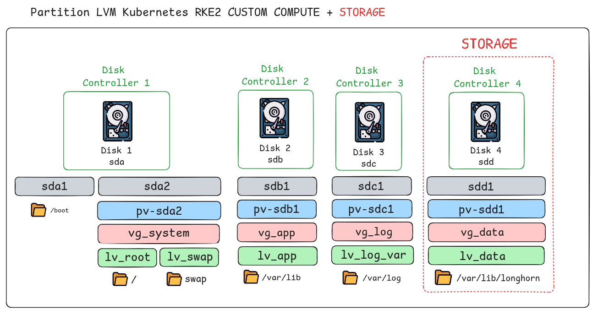
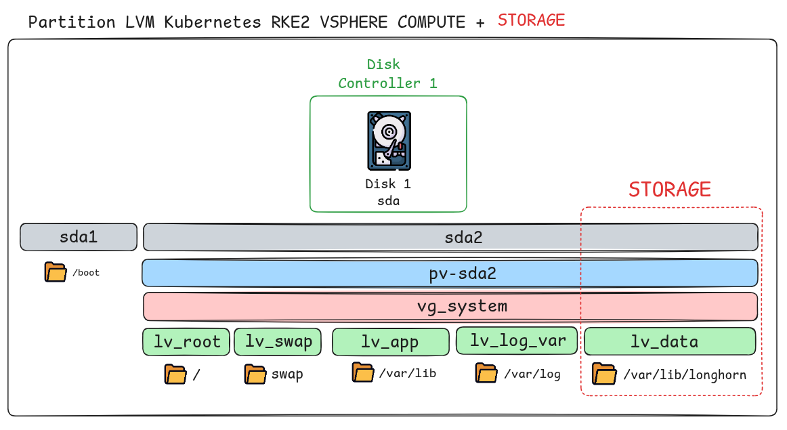
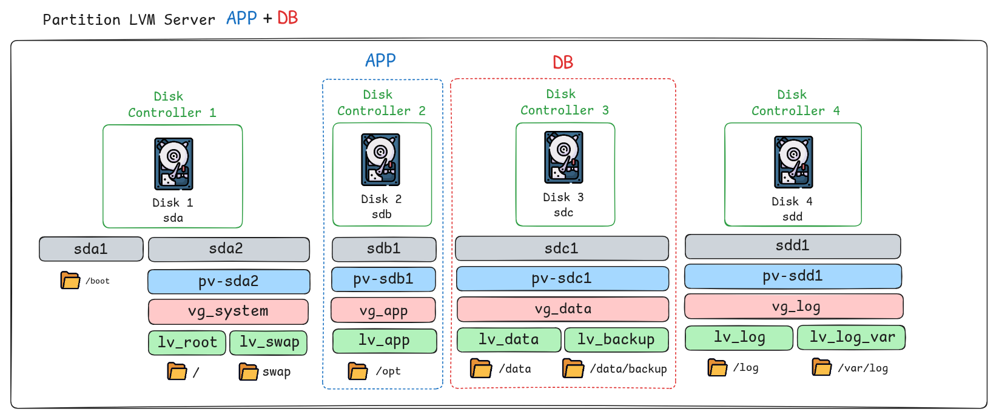

# packer_vsphere_iso

## Acknowledgments

Inspired by [packer-examples-for-vsphere](https://github.com/vmware/packer-examples-for-vsphere)
by VMware, Inc. — licensed under BSD-2-Clause.

## Kubernetes

Build OVF Debian to RKE2 Custom :
- Compute : No storage
- Storage : Storage with Longhorn

Build Template Debian to RKE2 Vsphere :
- Compute : No storage
- Storage : Storage with Longhorn

### Partition LVM

#### RKE CUSTOM

#### RKE VSPHERE

## VM

Build OVF Debian for VM :
- APP+DB : server with application + databases
- APP    : server with application
- DB     : server with databases

### Partition LVM

